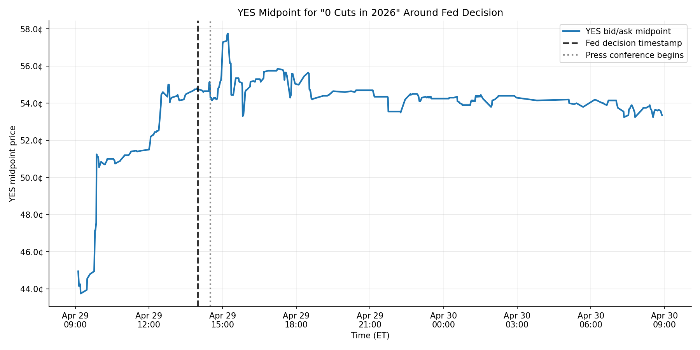
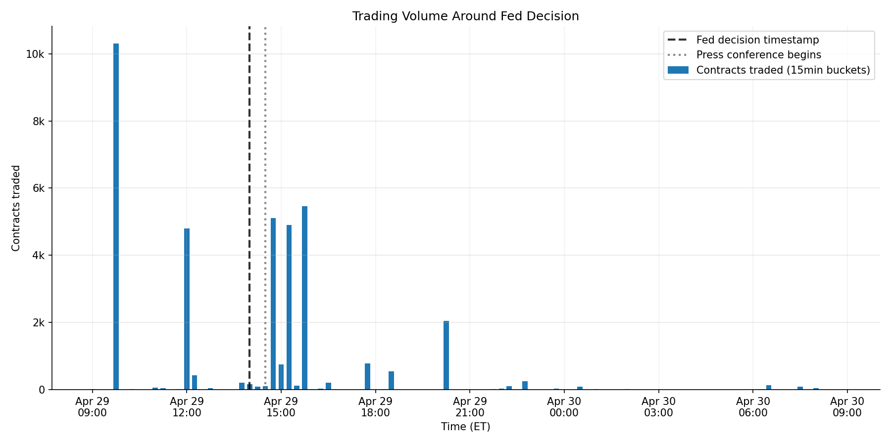
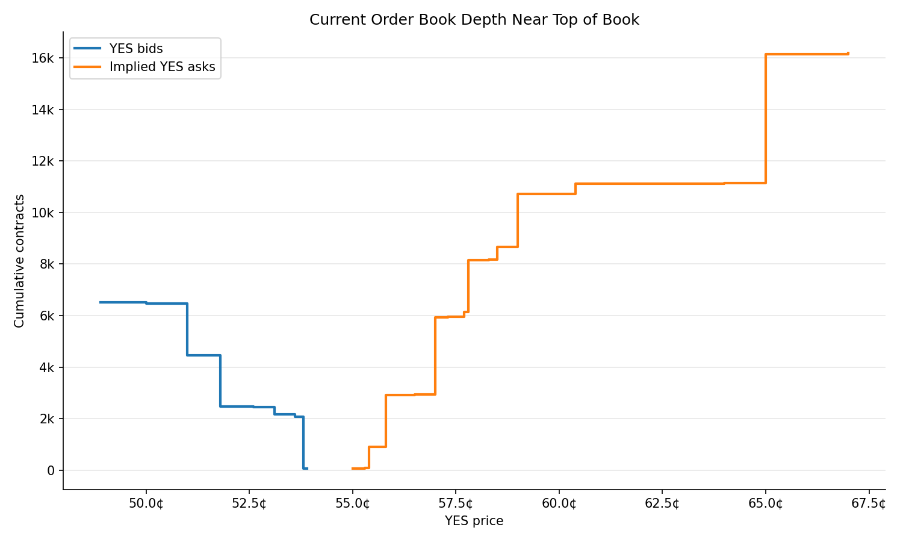
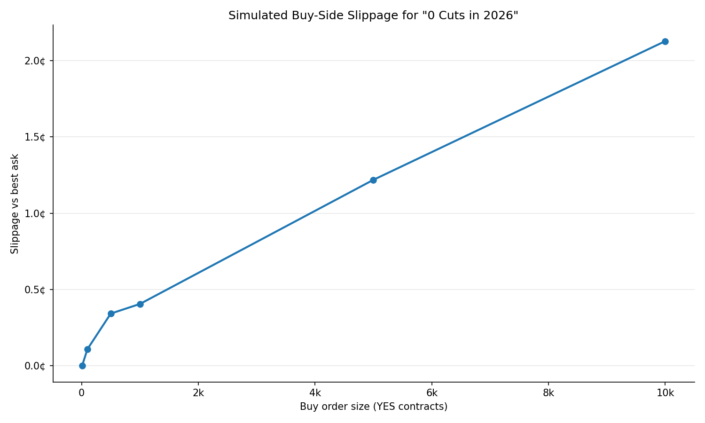

# Kalshi Market Reaction and Liquidity Study

This project analyzes a Kalshi binary prediction market using the Kalshi API. It focuses on the market:

**Will the Fed cut rates 0 times in 2026?**

The project studies two related questions:

1. How did the market behave around the April 29, 2026 FOMC statement and press conference?
2. What does the current order book imply about liquidity and simulated execution cost?

The goal is not to claim a profitable trading strategy. Instead, this is a small market-analysis workflow that combines price/volume activity, order book analysis, and simulated execution.

---

## Market analyzed

| Field | Value |
|---|---|
| Series | `KXRATECUTCOUNT` |
| Event | `KXRATECUTCOUNT-26DEC31` |
| Market | `KXRATECUTCOUNT-26DEC31-T0` |
| Market title | Will the Fed cut rates 0 times? |
| Subtitle | `0:: 0 bps` |

For this market:

- **YES** means the Fed cuts rates **0 times** in 2026.
- **NO** means the Fed cuts rates at least once in 2026.

The subtitle `0:: 0 bps` means the outcome corresponds to **0 basis points** of rate cuts. One basis point is 0.01 percentage points, and a typical Fed cut is often 25 bps. So `0 bps` corresponds to no cuts.

---

## Environment and data note

This project defaults to Kalshi’s sandbox API:
`https://demo-api.kalshi.co/trade-api/v2`

I first verified that the selected market and workflow run against the sandbox: market metadata, candlesticks, order book data, liquidity metrics, and simulated execution all work using the sandbox endpoint.

However, the sandbox version of this market had sparse historical candlestick activity in the selected event window. Since the goal of the project was to study market behavior around the April 29 Fed decision, I also ran the same workflow against Kalshi’s public production market-data API to produce a more meaningful historical analysis.

The code path is the same in both cases; only the API base URL and output folder change through environment variables.

---

## Setup

Create and activate a virtual environment:

```bash
python -m venv .venv
source .venv/bin/activate
```

Install dependencies:

```bash
pip install -r requirements.txt
```

---

## Running the project

### Run against Kalshi sandbox

This is the default mode:

```bash
python -m src.main
```

Outputs are written to:

```text
outputs/sandbox/
```

### Run against public production market data

This uses the same workflow with richer public market data:

```bash
KALSHI_BASE_URL="https://api.elections.kalshi.com/trade-api/v2" \
KALSHI_ENVIRONMENT_NAME="production" \
python -m src.main
```

Outputs are written to:

```text
outputs/production/
```

---

## Output files

Each run generates CSV files and plots.

```text
outputs/
  sandbox/
    market_summary.csv
    candlesticks.csv
    reaction_metrics.csv
    yes_bids.csv
    no_bids.csv
    implied_yes_asks.csv
    liquidity_metrics.csv
    yes_bid_depth.csv
    implied_yes_ask_depth.csv
    slippage_simulation.csv
    price_reaction.png
    volume_reaction.png
    orderbook_depth.png
    slippage_by_size.png

  production/
    market_summary.csv
    candlesticks.csv
    reaction_metrics.csv
    yes_bids.csv
    no_bids.csv
    implied_yes_asks.csv
    liquidity_metrics.csv
    yes_bid_depth.csv
    implied_yes_ask_depth.csv
    slippage_simulation.csv
    price_reaction.png
    volume_reaction.png
    orderbook_depth.png
    slippage_by_size.png
```

The main plots are:

| Plot | Purpose |
|---|---|
| `price_reaction.png` | Shows the YES midpoint price around the Fed decision and press conference |
| `volume_reaction.png` | Shows trading volume around the same window |
| `orderbook_depth.png` | Shows cumulative bid and implied ask depth near the top of book |
| `slippage_by_size.png` | Shows simulated buy-side slippage for different order sizes |

---

## Methodology

### 1. Market activity analysis

The project fetches one-minute candlesticks for the selected market over the configured event window.

The main price series is the **YES bid/ask midpoint**:

```text
midpoint = (YES bid + YES ask) / 2
```

I used the midpoint because many one-minute candlesticks do not contain an executed trade. In the production run, only 76 of the 336 returned candlesticks had an executed trade_close value. Because of that, using only trade prices would have produced a sparse chart. The bid and ask quotes still provide information about how the market was pricing the contract, even when no trade occurred.

The project also tracks:

- traded volume
- bid/ask spread
- open interest
- before/after event-window metrics

The event anchors are:

- **2:00 PM ET on April 29, 2026**: FOMC statement / policy decision release. The Federal Reserve held the target range for the federal funds rate at **3.50%–3.75%**.
- **2:30 PM ET on April 29, 2026**: Fed Chair press conference begins.

### 2. Order book analysis

Kalshi’s order book endpoint returns YES bids and NO bids. Since YES and NO are complementary binary outcomes, a NO bid can be converted into an implied YES ask:

```text
implied YES ask = 1 - NO bid
```

Using this, the project reconstructs a YES-side order book and computes:

- best YES bid
- implied YES ask
- spread
- midpoint
- total displayed bid depth
- total displayed implied ask depth
- number of price levels on each side

### 3. Simulated execution

The project simulates buying YES contracts by walking the implied YES ask book from the cheapest ask upward.

For each target order size, it computes:

- filled quantity
- unfilled quantity
- average execution price
- worst fill price
- total cost
- slippage versus the best ask

This gives a practical view of tradability. A market can have a reasonable top-of-book price but still become expensive to trade in larger size if depth is limited.

---

## Key findings from production public market-data run

The richer production-market-data run returned 336 candlesticks for the selected window.

### Market activity





In the two-hour window before the 2:00 PM Fed decision timestamp:

- YES midpoint moved from **51.5¢** to **54.7¢**
- pre-event move: **+3.2¢**

In the two-hour window after the 2:00 PM timestamp:

- YES midpoint moved from **54.75¢** to **54.7¢**
- net post-event move: **-0.05¢**
- volume increased from **5,476.12** contracts before the event to **16,715.69** after the event
- post/pre volume ratio: **3.05x**

This suggests that the market had already moved toward the “0 cuts in 2026” outcome before the formal 2:00 PM decision timestamp. After the event, trading activity increased substantially, but the net midpoint move over the two-hour window was small.

The price chart also shows a temporary post-event spike around the press conference window before the market settled back. This could be interpreted as a short-lived post-event volatility or order-flow adjustment rather than a sustained directional repricing.

### Liquidity and execution



At run time, the production order book showed:

- best YES bid: **53.90¢**
- implied YES ask: **55.00¢**
- spread: **1.10¢**
- midpoint: **54.45¢**
- total YES bid depth: **71,929.70** contracts
- total implied YES ask depth: **32,668.21** contracts




The slippage simulation showed:

| Buy size | Slippage vs best ask |
|---:|---:|
| 10 contracts | 0.00¢ |
| 100 contracts | 0.108¢ |
| 500 contracts | 0.342¢ |
| 1,000 contracts | 0.405¢ |
| 5,000 contracts | 1.219¢ |
| 10,000 contracts | 2.128¢ |

This suggests the market was tradable for small buy orders, but larger orders would walk the book and face increasing execution cost.

---

## Assumptions and limitations

- The project uses **2:00 PM ET** as the formal FOMC statement timestamp.
- It also marks **2:30 PM ET** as the press conference start.
- The main price series is the bid/ask midpoint, not always an executed trade price.
- The production event analysis uses public production market data because sandbox historical activity was sparse.
- The order book analysis uses a current snapshot from the time the script is run, not historical order book snapshots from the event window.
- The project does not claim that the Fed decision alone caused the observed price movement.
- The analysis focuses on one market. Related markets such as exactly 1 cut, 2 cuts, or 3 cuts could be compared in a larger version.

---

## Implementation notes

I separated API access from analysis logic so that the client only handles HTTP requests, while the market activity and order book modules handle transformation and metrics. This made the project easier to test and easier to extend to other markets.

The project is configuration-driven. The selected series, event, market ticker, event timestamps, API base URL, and output directory are all defined in `config.py`. The API base URL and output environment can also be overridden with environment variables, which allows the same workflow to run against Kalshi’s sandbox or public production market data.

The analysis saves both intermediate and final outputs. For example, the raw parsed YES bids, NO bids, and implied YES asks are saved as CSVs, along with reaction metrics, liquidity metrics, slippage simulations, and plots. This makes the workflow easier to inspect and debug, rather than only producing final charts.

---

## Project structure

```text
kalshi-market-reaction-study/
  README.md
  requirements.txt
  .env.example

  src/
    __init__.py
    config.py
    kalshi_client.py
    market_activity.py
    orderbook_analysis.py
    plots.py
    main.py

  outputs/
    sandbox/
    production/
```

### Main modules

| File | Purpose |
|---|---|
| `config.py` | Stores market tickers, event timestamps, API URL, and output settings |
| `kalshi_client.py` | Handles Kalshi API calls |
| `market_activity.py` | Parses candlesticks and computes reaction metrics |
| `orderbook_analysis.py` | Parses order book data and simulates execution |
| `plots.py` | Generates charts |
| `main.py` | Runs the end-to-end workflow |

---

## Future work

With more time, I would extend this in several ways:

1. Compare multiple related markets under the same event, such as exactly 0 cuts, 1 cut, 2 cuts, and 3 cuts, to estimate how the full rate-cut distribution shifted.
2. Compare Kalshi prices with more external reference signals such as Fed funds futures, macro forecasts, or news timestamps.
3. Capture order book snapshots over time in a live process, or use historical depth data if available, instead of relying only on the current order book.
4. Create a small dashboard or CLI arguments so users can select different markets and event windows.

---


## Glossary

**YES price**  
The price of a contract that pays $1 if the market outcome happens. A YES price of 55¢ roughly corresponds to a 55% market-implied probability, before accounting for spread and fees.

**NO price**  
The price of a contract that pays $1 if the market outcome does not happen.

**Bid**  
The highest price someone is currently willing to pay for a contract.

**Ask**  
The lowest price someone is currently willing to sell a contract for.

**Spread**  
The gap between the best ask and best bid. It represents immediate trading friction. For example, if YES can be bought at 55.0¢ and immediately sold at 53.9¢, the spread is 1.1¢ per contract before fees.

**Midpoint**  
The halfway point between the best bid and best ask. It is a rough estimate of the market’s current fair price between buyers and sellers.

**Order book**  
The list of current buy and sell interest at different prices.

**Depth**  
The number of contracts available in the order book. More displayed depth usually means the market can absorb larger trades more easily.

**Level**  
One price point in the order book. For example, “55.0¢ for 66 contracts” is one level.

**Liquidity**  
How easy it is to trade without moving the price much. Tighter spreads and deeper books usually indicate better liquidity.

**Slippage**  
The difference between the best available price and the average price actually received for a trade. Slippage usually increases as order size grows.

**Slippage curve**  
A plot showing how execution price or slippage changes as order size increases. A flatter curve means the market is easier to trade in size; a steeper curve means larger trades become expensive quickly.

**Candlestick**  
A time-bucketed summary of market activity. In this project, one-minute candlesticks are used to track quote midpoint, volume, spread, and open interest over time.

**Volume**  
The number of contracts traded during a period.

**Open interest**  
The number of contracts currently outstanding.

**Basis point / bps**  
One basis point is 0.01 percentage points. A 25 bps Fed rate cut equals a 0.25 percentage-point cut.